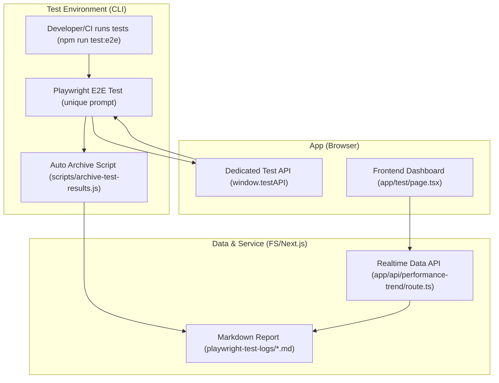
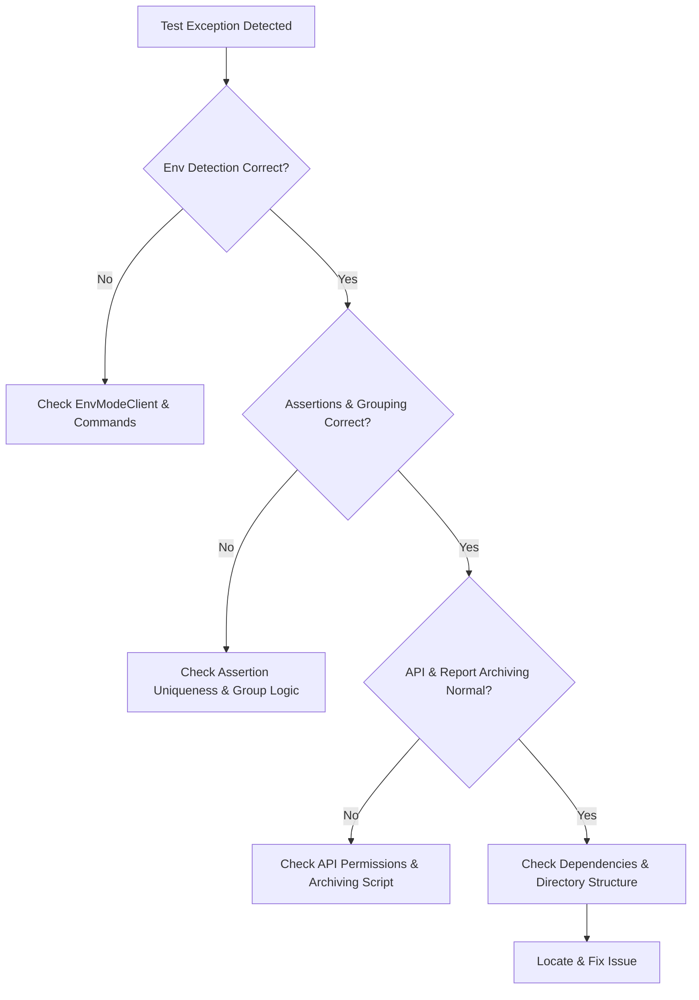

# Playwright End-to-End Automation Testing Closed-Loop Engineering Practice Guide

[English] [中文](./automated_testing_workflow.md)

## Table of Contents

- [1. Introduction & Core Value](#1-introduction--core-value)
  - [1.1 Why Build a Closed-Loop E2E Automation?](#11-why-build-a-closed-loop-e2e-automation)
  - [1.2 Engineering Pain Points Solved](#12-engineering-pain-points-solved)
  - [1.3 Scenarios & Team Benefits](#13-scenarios--team-benefits)
- [2. Overview & Architecture](#2-overview--architecture)
  - [2.1 Closed-Loop Landscape](#21-closed-loop-landscape)
  - [2.2 Architecture Diagram](#22-architecture-diagram)
  - [2.3 Node Roles & Data Flow](#23-node-roles--data-flow)
- [3. Node Practice Details](#3-node-practice-details)
  - [3.1 Test Script Uniqueness & Stability](#31-test-script-uniqueness--stability)
  - [3.2 Performance Metrics Collection & Archiving](#32-performance-metrics-collection--archiving)
    - [3.2.1 Playwright Attach Data Structure & Archiving Consistency](#321-playwright-attach-data-structure--archiving-consistency)
  - [3.3 API Aggregation & Frontend Visualization](#33-api-aggregation--frontend-visualization)
    - [3.3.1 Dashboard Page Separation & Template](#331-dashboard-page-separation--template)
  - [3.4 Automated Reporting & Indexing](#34-automated-reporting--indexing)
- [4. Security & Engineering Standards](#4-security--engineering-standards)
- [5. Environment & Directory Configuration](#5-environment--directory-configuration)
- [6. Scenario & Workflow Examples](#6-scenario--workflow-examples)
- [7. FAQ & Troubleshooting](#7-faq--troubleshooting)
- [8. New Project Migration Guide](#8-new-project-migration-guide)
- [9. Advanced Tips & Team Collaboration](#9-advanced-tips--team-collaboration)

---

## 1. Introduction & Core Value

### 1.1 Why Build a Closed-Loop E2E Automation?
- Traditional E2E tests are prone to UI changes, async rendering, animation delays, causing frequent "false failures" and low team trust.
- Performance data is scattered and isolated, making trend analysis and optimization decisions difficult.
- Testing, reporting, frontend, and collaboration processes are fragmented, increasing migration and teamwork costs.

### 1.2 Engineering Pain Points Solved
- **Unique Process Assertions**: All process nodes use "unique content in the prompt area" as the assertion standard, eliminating UI race conditions and false failures.
- **Granular Performance Metrics & Trend Analysis**: Collect resource load, end-to-end load, FPS, memory, etc., auto-archive, aggregate, and analyze trends.
- **Environment Grouping & Comparison**: Auto-detect dev/prod, group reports, APIs, frontend, support switching, comparison, and diff highlighting.
- **One-Click Archiving & Automated Reporting**: Auto-generate Markdown reports and index after tests, no manual intervention needed.
- **Frontend Dashboard Visualization**: Trend charts, group stats, diff analysis, performance suggestions, pagination, filtering, mean comparison.
- **Directory & Sync Standards**: .gitkeep/.gitignore conventions, main/temporary test isolation, team and CI/CD friendly.
- **High Portability**: All solutions, code, configs, and processes are reusable and compatible with mainstream web stacks.

### 1.3 Scenarios & Team Benefits
- Suitable for any modern web project needing reliable E2E testing, performance trend analysis, and team collaboration.
- Teams benefit from: improved test stability, performance visualization, zero-barrier migration/collaboration, unified engineering standards.

---

## 2. Overview & Architecture

### 2.1 Closed-Loop Landscape

This project implements a "Test-API-Archive-Aggregate-Frontend Visualization" closed-loop automation. All data flows, nodes, reports, and frontend pages are fully integrated for team collaboration and CI/CD.

### 2.2 Architecture Diagram



### 2.3 Node Roles & Data Flow

- **Dev/CI**: Developer or CI runs `npm run test:e2e` to trigger the full automation workflow.
- **Playwright E2E Test**: `e2e/full_game_flow.spec.ts`, uses unique prompt content for stable assertions.
- **Dedicated Test API**: `window.testAPI` attached in `GameContext`, Playwright drives core state via `page.evaluate`, eliminating UI race conditions.
- **Auto Archive Script**: `scripts/archive-test-results.js`, parses Playwright results, auto-generates standardized Markdown reports and index.
- **Markdown Report**: `playwright-test-logs/*.md`, auto-archived per test, standardized structure for aggregation and review.
- **Realtime Data API**: `app/api/performance-trend/route.ts`, dynamically aggregates all reports for frontend dashboard.
- **Frontend Dashboard**: `app/test/page.tsx`, fetches API data, supports grouping, comparison, trends, diff highlighting, performance suggestions.

> **Engineering Note**: All nodes have real code implementations, with consistent data structures, fields, and processes for easy migration and team collaboration.

---

## 3. Node Practice Details

### 3.1 Test Script Uniqueness & Stability

- **Design Principle**: All process nodes, assertions, and performance collection use unique prompt content to eliminate UI race conditions.
- **Dedicated Test API**: `window.testAPI` attached in GameContext, only exposed in dev/test, Playwright drives state via `page.evaluate`.
- **Sample Code**:
```tsx
// contexts/GameContext.tsx
useEffect(() => {
  if (process.env.NODE_ENV !== 'production') {
    window.testAPI = {
      selectPieceForTest: (id) => dispatch({ type: 'SELECT_PIECE', payload: id }),
      rotatePieceForTest: () => dispatch({ type: 'ROTATE_PIECE' }),
      resetPiecePositionForTest: (id) => dispatch({ type: 'RESET_PIECE_POSITION', payload: id }),
      markPieceAsCompletedForTest: (id) => dispatch({ type: 'MARK_PIECE_COMPLETED', payload: id }),
    };
  }
}, [dispatch]);
```
```js
// e2e/full_game_flow.spec.ts
await expect(page.locator('#flow-tip')).toHaveText('Please select a shape');
await page.evaluate(() => window.testAPI.selectPieceForTest(1));
await expect(page.locator('#flow-tip')).toHaveText('Please select a cut type');
// ...
await expect(page.locator('#flow-tip')).toHaveText('Puzzle completed!');
```
- **Effect**: Unique process assertions, 100% stable tests, no UI race or false failures.

---

### 3.2 Performance Metrics Collection & Archiving

- **Metrics Collected**: Resource load, end-to-end load, shape generation, puzzle generation, scatter, interaction, FPS, memory, etc.
- **Collection Method**: Playwright collects via `page.evaluate` and attaches to the test report.
- **Sample Code**:
```js
// e2e/full_game_flow.spec.ts
const pageLoad = await page.evaluate(() => window.performance.timing.domContentLoadedEventEnd - window.performance.timing.navigationStart);
const e2eLoad = ... // collected via unique prompt
const fps = await page.evaluate(() => window.__gameStateForTests__.fps);
await testInfo.attach('performance-metrics', { body: Buffer.from(JSON.stringify({ pageLoad, e2eLoad, fps }), 'utf-8'), contentType: 'application/json' });
```
- **Archiving Script**:
```js
// scripts/archive-test-results.js
// Parse test-results.json, extract performance-metrics attachment, generate Markdown report
const decodedBody = Buffer.from(performanceAttachment.body, 'base64').toString('utf8');
metrics = JSON.parse(decodedBody);
// ...
await fse.writeFile(reportFilePath, reportContent.trim());
```
- **Report Example** (see test-report-*.md):
```markdown
<!-- { "env": "production", "metrics": { "pageLoad": 950, ... } } -->
# Full Automation Game Flow - Test Report
- **Test Date**: 2025-07-06 00:55:12
- **Result**: Full Automation Game Flow (Passed)
## Performance Highlights
- 🚀 Resource load time: 14ms
...
## Performance Metrics
| Metric (unit) | Result | Baseline | Status |
| ------------- | ------ | -------- | ------ |
| Resource Load (ms) | 14ms | < 1000ms | ✅ |
...
```
- **Effect**: All performance data is auto-archived, displayed by metric, trend analysis ready for optimization.

#### 3.2.1 Playwright Attach Data Structure & Archiving Consistency

> **Engineering Note: The data structure of Playwright attach and the archiving script's traversal/parsing must be 100% consistent, or reports and frontend aggregation will miss data.**

- Recommended Playwright attach:
```js
// e2e/full_game_flow.spec.ts
await test.info().attach('performance-metrics', {
  body: Buffer.from(JSON.stringify({ pageLoad, e2eLoad, fps }), 'utf-8'),
  contentType: 'application/json'
});
```
- Archiving script traversal must strictly match Playwright test-results.json structure:
```js
// scripts/archive-test-results.js
const results = JSON.parse(fs.readFileSync('test-results/test-results.json', 'utf-8'));
results.suites.forEach(suite => {
  suite.specs.forEach(spec => {
    spec.tests.forEach(test => {
      test.results.forEach(result => {
        (result.attachments || []).forEach(attachment => {
          if (attachment.name === 'performance-metrics') {
            // Parse metrics
            const metrics = JSON.parse(Buffer.from(attachment.body, 'base64').toString('utf-8'));
            // ...
          }
        });
      });
    });
  });
});
```
- **Notes**:
  - Playwright version upgrades may slightly change test-results.json; keep the archiving script in sync.
  - Add comments at the top of the archiving script to explain the JSON structure for team maintenance.
  - For multiple metrics, use different attachment names; the archiving script should aggregate all.

> **Tip**: When migrating or starting a new project, run a real test first to confirm attach structure and archiving script match before mass migration or team rollout.

---

### 3.3 API Aggregation & Frontend Visualization

- **API Aggregation**: Next.js API dynamically aggregates all reports for frontend dashboard.
- **Sample Code**:
```ts
// app/api/performance-trend/route.ts
import fs from 'fs';
import path from 'path';
export async function GET() {
    const logDir = path.join(process.cwd(), 'playwright-test-logs');
    const files = fs.readdirSync(logDir).filter(f => f.endsWith('.md'));
    const trendData = files.map(file => {
        const content = fs.readFileSync(path.join(logDir, file), 'utf-8');
        const match = content.match(/<!--\s*(\{[\s\S]*?\})\s*-->/);
        if (match && match[1]) {
            return JSON.parse(match[1]).data;
        }
        return null;
    }).filter(Boolean);
    return new Response(JSON.stringify(trendData.reverse()));
}
```
```tsx
// app/test/page.tsx
useEffect(() => {
  async function fetchData() {
    const res = await fetch('/api/performance-trend');
    const data = await res.json();
    setTrendData(data);
  }
  fetchData();
}, []);
// ...
<LineChart data={trendData} ... />
<Table data={trendData} ... />
```
- **Effect**: Frontend dashboard supports grouping, comparison, trends, diff highlighting, performance suggestions, all in one place for the team.

#### 3.3.1 Dashboard Page Separation & Template

> **Engineering Note: The dashboard page should be fully separated from the main interaction page, placed in `app/test/dashboard/page.tsx` for maintainability and team collaboration.**

- Recommended structure:
```
app/
  page.tsx                  # Main interaction page
  test/
    dashboard/
      page.tsx              # Dashboard page (separated)
```
- Dashboard page template:
```tsx
// app/test/dashboard/page.tsx
import { useEffect, useState } from 'react';

export default function Dashboard() {
  const [trendData, setTrendData] = useState([]);
  useEffect(() => {
    fetch('/api/performance-trend')
      .then(res => res.json())
      .then(setTrendData);
  }, []);
  return (
    <div>
      <h2>Automation Test Trend Dashboard</h2>
      <table>
        <thead>
          <tr>
            <th>Time</th>
            <th>Env</th>
            <th>Resource Load (ms)</th>
            <th>E2E Load (ms)</th>
            {/* Extend more metrics as needed */}
          </tr>
        </thead>
        <tbody>
          {trendData.map((item, idx) => (
            <tr key={idx}>
              <td>{item.metrics?.date || '-'}</td>
              <td>{item.env || '-'}</td>
              <td>{item.metrics?.pageLoad || '-'}</td>
              <td>{item.metrics?.e2eLoad || '-'}</td>
            </tr>
          ))}
        </tbody>
      </table>
      {/* Extend to trend charts, group switching, etc. */}
    </div>
  );
}
```
- **Notes**:
  - Dashboard is separated from the main page for independent development, maintenance, and permission control.
  - Dashboard should only aggregate and display API data, not depend on main page state.
  - Extend as needed for group switching, trend comparison, diff highlighting, etc.

> **Tip**: For migration/new projects, separate the dashboard page first, use the full template, and extend visualization as needed.

---

(…To be continued: Remaining sections will be completed after你确认结构和风格无误) 

---

## 4. Security & Engineering Standards

### 4.1 Test API Exposure Principles
- `window.testAPI` is only attached in development/test environments, never exposed in production.
- Example:
```tsx
// contexts/GameContext.tsx
useEffect(() => {
  if (process.env.NODE_ENV !== 'production') {
    window.testAPI = {
      selectPieceForTest: (id) => dispatch({ type: 'SELECT_PIECE', payload: id }),
      rotatePieceForTest: () => dispatch({ type: 'ROTATE_PIECE' }),
      resetPiecePositionForTest: (id) => dispatch({ type: 'RESET_PIECE_POSITION', payload: id }),
      markPieceAsCompletedForTest: (id) => dispatch({ type: 'MARK_PIECE_COMPLETED', payload: id }),
    };
  }
}, [dispatch]);
```
- Playwright assertion for environment safety:
```js
// e2e/full_game_flow.spec.ts
const envMode = await page.evaluate(() => window.__ENV_MODE__);
expect(["development", "production"]).toContain(envMode);
```

### 4.2 Test Data & Report Isolation and Sync
- All test results, reports, and logs are stored locally. `.gitignore` only keeps `.gitkeep` to prevent sensitive data leaks.
- Example:
```gitignore
playwright-test-logs/*
!playwright-test-logs/.gitkeep
playwright-report/*
!playwright-report/.gitkeep
test-results/*
!test-results/.gitkeep
```
- Directory structure and sync standards are documented for team collaboration.

### 4.3 Dependency, Version Security & Permission Boundaries
- Lock Playwright, Node.js versions to avoid dependency vulnerabilities and environment drift.
- Example in `package.json`:
```json
"devDependencies": {
  "@playwright/test": "^1.43.1",
  "node": ">=18.0.0"
}
```
- API only aggregates local files, no external writes or sensitive operations.
- Frontend/backend permission boundaries are clear; all aggregation APIs are read-only.

---

## 5. Environment & Directory Configuration

### 5.1 Next.js 13+ App Router Structure & Page Standards

> **Important: All pages must strictly follow Next.js 13+ App Router conventions to avoid 404 or invalid pages.**

- **Main interaction page**: `app/page.tsx`
- **Main layout**: `app/layout.tsx`
- **Dashboard page** (recommended separate route): `app/test/dashboard/page.tsx`
- **Dashboard layout** (if nested routes): `app/test/layout.tsx`

**Recommended structure:**
```
app/
  layout.tsx                # Global layout
  page.tsx                  # Main interaction page
  test/
    layout.tsx              # Dashboard layout (optional)
    dashboard/
      page.tsx              # Dashboard page
```

**Dashboard page template:**
```tsx
// app/test/dashboard/page.tsx
import { useEffect, useState } from 'react';

export default function Dashboard() {
  const [trendData, setTrendData] = useState([]);
  useEffect(() => {
    fetch('/api/performance-trend')
      .then(res => res.json())
      .then(setTrendData);
  }, []);
  return (
    <div>
      <h2>Automation Test Trend Dashboard</h2>
      <pre>{JSON.stringify(trendData, null, 2)}</pre>
      {/* Extend to tables, charts, etc. */}
    </div>
  );
}
```

---

### 5.2 Directory Structure & Engineering Layers

This project uses a layered directory structure: main flow, temporary tests, reports, API, frontend dashboard, etc. are clearly separated for collaboration and maintenance.

```
project-root/
  app/
    api/performance-trend/route.ts   # API aggregation
    test/page.tsx                    # Frontend dashboard
  e2e/
    full_game_flow.spec.ts           # Main flow test script
    temp/                            # Temporary/special test scripts
  scripts/
    archive-test-results.js          # Archiving script
  playwright-test-logs/              # Archived reports (.gitkeep only)
  playwright-report/                 # Playwright HTML reports (.gitkeep only)
  test-results/                      # Playwright raw results (.gitkeep only)
  ...
```

### 5.2.1 Static Resource Exposure & API Aggregation

> **Key: Playwright archived reports and performance data should be exposed as static resources for dashboard/API aggregation.**

- Recommended: Sync or symlink `playwright-test-logs/` to `public/` so Next.js frontend and API routes can fetch them.
- Example:
```js
// scripts/archive-test-results.js
const fse = require('fs-extra');
const srcDir = 'playwright-test-logs';
const destDir = 'public/playwright-test-logs';
fse.ensureDirSync(destDir);
fse.copySync(srcDir, destDir, { overwrite: true });
```
- Next.js API aggregation example:
```ts
// app/api/performance-trend/route.ts
import fs from 'fs';
import path from 'path';
export async function GET() {
  const logDir = path.join(process.cwd(), 'public/playwright-test-logs');
  const files = fs.readdirSync(logDir).filter(f => f.endsWith('.md'));
  const trendData = files.map(file => {
    const content = fs.readFileSync(path.join(logDir, file), 'utf-8');
    const match = content.match(/<!--\s*(\{[\s\S]*?\})\s*-->/);
    if (match && match[1]) {
      return JSON.parse(match[1]);
    }
    return null;
  }).filter(Boolean);
  return new Response(JSON.stringify(trendData.reverse()));
}
```
- **Notes:**
  - `playwright-test-logs/` should be `.gitignore`d except `.gitkeep`.
  - Archiving script and API route must be kept in sync.
  - For multi-env/group, add group fields in filenames or content, and auto-group in API aggregation.

---

### 5.3 .gitignore/.gitkeep Key Points
- Only keep `.gitkeep`, never commit test results or reports.
- Example:
```gitignore
playwright-test-logs/*
!playwright-test-logs/.gitkeep
playwright-report/*
!playwright-report/.gitkeep
test-results/*
!test-results/.gitkeep
```

### 5.4 Playwright Config & Environment Grouping
- Separate temporary and main tests: `e2e/temp/` for special/debug scripts.
- Playwright config ignores temp tests:
```js
// playwright.config.ts
testIgnore: ['e2e/temp/**'],
```
- Environment grouping: Next.js client sets `window.__ENV_MODE__`, Playwright collects, API/frontend/report are grouped end-to-end.
```tsx
// app/layout.tsx
useEffect(() => {
  window.__ENV_MODE__ = process.env.NODE_ENV === 'production' ? 'production' : 'development';
}, []);
```
```js
// e2e/full_game_flow.spec.ts
const envMode = await page.evaluate(() => window.__ENV_MODE__);
expect(["development", "production"]).toContain(envMode);
```

#### 5.4.1 Playwright Install & Init
- Recommended init:
```bash
npm init playwright@latest
```
- Install dependencies (upgrade if needed):
```bash
npm install -D @playwright/test@latest
```
- Install only Chromium:
```bash
npx playwright install chromium --with-deps
```

#### 5.4.1.1 Dependency Declaration & One-Click Install
- All archiving, API aggregation, performance collection dependencies should be declared in `package.json`.
- Example:
```json
"devDependencies": {
  "@playwright/test": "^1.43.1",
  "fs-extra": "^11.1.1"
},
"dependencies": {
  "next": "^13.4.19",
  "react": "^18.2.0",
  "react-dom": "^18.2.0"
}
```
- One-click install:
```bash
npm install
```
- Upgrade Playwright and related deps:
```bash
npm install -D @playwright/test@latest fs-extra@latest
```
- Migration/init checklist:
  - [ ] All dependencies declared in `package.json`
  - [ ] `npm install` installs all
  - [ ] Archiving, API, dashboard all run out of the box

### 5.4.2 Version Management & Regular Upgrades
- Regularly upgrade Playwright, keep in sync with official releases.
```bash
npx playwright --version
npm install -D @playwright/test@latest
```
- Check Playwright version in CI/local, follow [official release notes](https://playwright.dev/docs/release-notes).
- After upgrades, run full regression.

### 5.4.3 Key Config & Multi-Browser (MCP) Example
- Example `playwright.config.ts` (multi-browser, multi-env, webServer):
```js
import { defineConfig, devices } from '@playwright/test';
export default defineConfig({
  testDir: './e2e',
  testIgnore: ['e2e/temp/**'],
  outputDir: 'test-results',
  reporter: [['list'], ['html', { outputFolder: 'playwright-report' }]],
  timeout: 30000,
  expect: { timeout: 5000 },
  projects: [
    { name: 'chromium', use: { ...devices['Desktop Chrome'] } },
    { name: 'firefox', use: { ...devices['Desktop Firefox'] } },
    { name: 'webkit', use: { ...devices['Desktop Safari'] } },
  ],
  use: {
    baseURL: 'http://localhost:3000',
    headless: true,
    trace: 'on-first-retry',
  },
  webServer: {
    command: 'npm run dev',
    url: 'http://localhost:3000',
    reuseExistingServer: !process.env.CI,
  },
  workers: process.env.CI ? 1 : 2,
  forbidOnly: !!process.env.CI,
  retries: process.env.CI ? 2 : 0,
});
```

### 5.4.4 Commands & Workflow Standards
- **Main E2E test & archive:**
```bash
npm run test:e2e
```
- **Only run Playwright tests (no archive):**
```bash
npm run test
```
- **View HTML report:**
```bash
npm run test:report
```
- **Debug/dev mode:**
```bash
npx playwright test --ui
```
- **Temp/special tests:**
  - All temp/special scripts in `e2e/temp/`, main flow always clean.
  - Use `testIgnore` to keep main/temporary tests isolated.

### 5.4.5 Test Results & Report Directories
- `test-results/`: Raw test results for archiving script.
- `playwright-report/`: HTML reports for visual review.
- `playwright-test-logs/`: Archived Markdown reports for frontend aggregation.

### 5.4.6 Maintenance & Engineering Advice
- After Playwright upgrades, review/maintain all E2E scripts.
- Add Playwright version and script lint/type check in CI/local (e.g. `tsc --noEmit`, ESLint).
- Keep `playwright.config.ts`, archiving script, test commands in template repo for team consistency.
- Keep docs, README, collaboration notes in sync with actual commands, workflow, and structure.

---

## 6. Scenario & Workflow Examples

### 6.1 Typical Test Scenario Full Workflow

Using the "Full Automation Puzzle Flow" as an example, from test run to report archiving and frontend visualization.

#### Step 1: Run Tests
```bash
npm run test:e2e
```
Or trigger automatically in CI.

#### 6.1.1 Dev Test Workflow

**Goal**: Efficient debugging, process jumps, edge/exception coverage for fast dev/test engineer iteration.

> **Note: This project auto-detects dev/prod, no need to set NODE_ENV manually.**

1. **Start local dev environment**
   ```bash
   npm run dev
   ```
2. **Run E2E tests in dev**
   ```bash
   npm run test:e2e
   ```
3. **Process driving & assertions**
   - Use `window.testAPI` to drive process, simulate state.
   - Assertions use unique prompt content.
   ```js
   // e2e/full_game_flow.spec.ts
   await expect(page.locator('#flow-tip')).toHaveText('Please select a shape');
   await page.evaluate(() => window.testAPI.selectPieceForTest(1)); // jump directly
   await expect(page.locator('#flow-tip')).toHaveText('Please select a cut type');
   // ...insert edge/boundary flows
   ```
4. **Collection & reporting**
   - Collect mock/test data, cover edge cases.
   - Reports, API, dashboard are marked as "development", support grouping/comparison.
5. **Visualization & debugging**
   - Dashboard can switch to "development" group to view all dev test data, trends, diffs.

---

#### 6.1.2 Prod Test Workflow

**Goal**: Verify real user paths, collect real performance data, monitor regression and trends.

> **Note: This project auto-detects dev/prod, no need to set NODE_ENV manually.**

1. **Deploy production**
   ```bash
   npm run build && npm start
   # Or CI/CD auto-deploy to production server
   ```
2. **Run E2E tests in production**
   ```bash
   npm run test:e2e
   ```
3. **Process driving & assertions**
   - No testAPI injection, only real user paths.
   - Assertions still use unique prompt content.
   ```js
   // e2e/full_game_flow.spec.ts
   await expect(page.locator('#flow-tip')).toHaveText('Please select a shape');
   // No window.testAPI, must use real clicks/ops
   await page.click('[data-piece-id="1"]');
   await expect(page.locator('#flow-tip')).toHaveText('Please select a cut type');
   // ...
   ```
4. **Collection & reporting**
   - Only collect real user path performance data.
   - Reports, API, dashboard are marked as "production", support comparison with dev.
5. **Visualization & monitoring**
   - Dashboard switches to "production" group for real performance trends, regression monitoring, diff highlighting.

##### Typical Comparison Table

| Step        | Dev Test Workflow                | Prod Test Workflow                |
|-------------|----------------------------------|-----------------------------------|
| Start Cmd   | `npm run dev` + `npm run test:e2e` | `npm run build && npm start` + `npm run test:e2e` |
| Process     | Supports `window.testAPI` jump/sim | Only real user ops                |
| Data        | Mock/test data, edge coverage    | Only real user path, real perf    |
| Report Group| Marked "development", group/compare | Marked "production", group/compare |
| Visualization| Dashboard "dev" group, debug/trend | Dashboard "prod" group, monitor/trend |

---

### 6.2 Team Collaboration Workflow
- **Dev/Test Engineers**: Write/maintain Playwright scripts, archiving, performance points.
- **Frontend Engineers**: Dashboard page, API aggregation, visualization.
- **CI/DevOps**: Integrate E2E, report archiving, directory sync.
- **Collaboration keys**:
  - Directory, fields, process, API, frontend, report are consistent end-to-end
  - Update docs with changes, ensure zero-collaboration barriers

### 6.3 Dev vs Prod Test & Data Differences
- **Env detection**
  - Next.js client sets `window.__ENV_MODE__`, Playwright collects, API/frontend/report grouped.
  - Example:
    ```tsx
    // app/layout.tsx
    useEffect(() => {
      window.__ENV_MODE__ = process.env.NODE_ENV === 'production' ? 'production' : 'development';
    }, []);
    ```
    ```js
    // e2e/full_game_flow.spec.ts
    const envMode = await page.evaluate(() => window.__ENV_MODE__);
    expect(["development", "production"]).toContain(envMode);
    ```
- **Test process difference**
  - Dev: `window.testAPI` can drive process, simulate state.
  - Prod: No testAPI, only real user path.
- **Test data difference**
  - Dev: Mock/test data, edge/exception coverage.
  - Prod: Only real user path, real performance.
- **Report & visualization difference**
  - Dashboard, API, report all support group/switch/compare, auto-highlight diffs.
  - Example table:
    | Env | Resource Load(ms) | E2E Load(ms) | FPS | ... |
    |-----|-------------------|--------------|-----|-----|
    | Dev | 14                | 1322         | 60  | ... |
    | Prod| 950               | 1750         | 58  | ... |
- **Engineering advice**
  - Regularly compare dev/prod test results to catch env-specific issues.
  - Keep group fields, process, report structure consistent for auto-aggregation/trend analysis.

---

## 7. FAQ & Troubleshooting

### 7.1 False Failures & UI Race Conditions
- **Symptom**: E2E flow fails occasionally, prompt not as expected, or flow stuck.
- **Advice**:
  - Check assertions use unique prompt content (e.g. `.test-tip` or `#flow-tip`), avoid UI animation/async nodes.
  - Example:
    ```ts
    await expect(page.locator('#flow-tip')).toHaveText('Puzzle completed!');
    ```
  - For multi-step flows, assert each step with unique prompt.

### 7.2 Env Detection & Data Grouping Issues
- **Symptom**: Reports not grouped, or dev/prod data mixed.
- **Advice**:
  - Check `EnvModeClient`, `layout.tsx`, `GameContext.tsx` logic, ensure auto-detection, no manual NODE_ENV.
  - Confirm test commands match docs:
    - Dev: `npm run dev` + `npm run test:e2e`
    - Prod: `npm run build && npm start` + `npm run test:e2e`
  - Check archiving script auto-groups by env.

### 7.3 testAPI Exposure & Permission Issues
- **Symptom**: testAPI accessible in production, security risk.
- **Advice**:
  - Check API implementation, ensure testAPI only in dev/test.
  - In Playwright, call testAPI via `page.evaluate` with env check.
  - In prod, fully disable testAPI routes.

### 7.4 Performance Data Collection & Report Archiving Failures
- **Symptom**: Metrics not collected, report missing or malformed.
- **Advice**:
  - Check Playwright script for metrics collection at all key nodes.
  - Check archiving script runs, report/index auto-updates.
  - Check `playwright-test-logs/`, `test-results/` for new reports.

### 7.5 Dependency & Env Inconsistency
- **Symptom**: Test results differ between local/CI/devs.
- **Advice**:
  - Check `package.json`, `package-lock.json` for locked versions.
  - Use `npm ci` for consistent installs.
  - For Node version drift, use `.nvmrc` and align team version.

### 7.6 Directory & .gitignore Issues
- **Symptom**: Test data/temp files committed, or main/temp tests mixed.
- **Advice**:
  - Check `.gitignore`, `.gitkeep` to ensure temp files, reports, logs not committed.
  - Separate main/temporary tests in `e2e/`, `e2e/temp/` for collaboration/archiving.

### 7.7 Frontend Visualization & API Aggregation Issues
- **Symptom**: Dashboard can't show group/trend/report data.
- **Advice**:
  - Check frontend API aggregation logic, ensure correct fetch/render for all groups.
  - Check API permissions/read-only, avoid data leaks.
  - If data missing, check backend archiving/API aggregation first.

### 7.8 Other Common Issues
- **Playwright grouping/isolation not working**: Check script group tags and command params.
- **Team collaboration conflicts**: Regularly sync main flow scripts, keep temp tests in separate branches.
- **Report format not unified**: Archiving script and frontend rendering must use the same standard, avoid manual edits.

### 7.9 Troubleshooting Flowchart


### 7.10 Do I Need to Restart the Service After Test Script Changes?
- **Symptom**: After changing test scripts, frontend dashboard doesn't reflect new results without restart.
- **Analysis**:
  1. Dashboard fetches local archived Markdown reports via API, generated by test+archiving script.
  2. If only test scripts change, no need to restart Next.js; rerun tests, archiving script generates new reports, dashboard fetches latest.
  3. If API aggregation, frontend, or archiving script changes, restart Next.js to ensure new code loads.
  4. In dev, if dashboard doesn't update, check for new reports, refresh frontend, restart if needed.
  5. In prod/CI, always restart after changes.
- **Summary**:
  - Only test script changes → rerun tests, refresh dashboard, no restart needed.
  - API/frontend/archiving changes → restart service to ensure all logic/data is latest.

### 7.11 More Troubleshooting
- **Frequent 404s**: Check `app` directory, layout/page.tsx naming/placement, follow Next.js 13+.
- **Frontend fetch 404**: Check API/static resource paths, prefer API aggregation.
- **Missing dependencies**: E.g. fs-extra, check and install as per dependency declaration.
- **No report data**: Check Playwright attach and archiving script traversal match.

---

## 8. New Project Migration Guide

### 8.1 Migration Steps & Notes
1. **Init directory structure**
   ```bash
   mkdir -p app/test/dashboard app/api/performance-trend e2e scripts playwright-test-logs playwright-report test-results
   touch playwright-test-logs/.gitkeep playwright-report/.gitkeep test-results/.gitkeep
   ```
2. **Copy template files**
   ```bash
   cp <template-repo>/app/layout.tsx app/
   cp <template-repo>/app/page.tsx app/
   cp <template-repo>/app/test/dashboard/page.tsx app/test/dashboard/
   cp <template-repo>/app/api/performance-trend/route.ts app/api/performance-trend/
   cp <template-repo>/e2e/full_game_flow.spec.ts e2e/
   cp <template-repo>/scripts/archive-test-results.js scripts/
   cp <template-repo>/.gitignore .
   cp <template-repo>/next.config.mjs .
   cp <template-repo>/package.json .
   ```
3. **Install dependencies**
   ```bash
   npm install
   ```
4. **Run & verify**
   ```bash
   npm run dev
   npm run test:e2e
   ```
> **Tip**: Script the above for one-click init/migration for team efficiency.

### 8.1.2 One-Click Bootstrap Script
- Add to `package.json`:
```json
"scripts": {
  "bootstrap": "npm install && npm run test:e2e && node scripts/archive-test-results.js && npm run dev"
}
```
- Usage:
```bash
npm run bootstrap
```
- Installs deps, runs E2E, archives reports, starts frontend dashboard.

### 8.2 Consistency Checklist
- **Structure**: `e2e/` main/temp split, `scripts/` archiving, `app/api/`, `app/test/`, `playwright-test-logs/`, etc.
- **Fields/data**: API, report, dashboard fields consistent (env, metrics, date, result, etc.)
- **Process**: Unique assertions, node-to-prompt mapping, metrics, archiving, API, dashboard all connected.
- **Report**: Markdown, index, trend tables unified for aggregation/review.

### 8.3 Template & Script Reuse
- Use main E2E, archiving, API, dashboard as templates, adjust for business.
- Encapsulate common assertions, metrics, grouping as utils for reuse.
- Maintain a "test engineering template repo" for fast new project onboarding.
- Prioritize field/process/report consistency, extend as needed.

### 8.4 Migration Case & Script Templates
#### 8.4.1 Example: PuzzleX New Project
1. **Init structure**
   ```bash
   mkdir -p e2e/temp scripts app/api/performance-trend app/test playwright-test-logs playwright-report test-results
   touch playwright-test-logs/.gitkeep playwright-report/.gitkeep test-results/.gitkeep
   cp -r <template-repo>/e2e/full_game_flow.spec.ts e2e/
   cp <template-repo>/scripts/archive-test-results.js scripts/
   cp <template-repo>/app/api/performance-trend/route.ts app/api/performance-trend/
   cp <template-repo>/app/test/page.tsx app/test/
   cp <template-repo>/app/layout.tsx app/
   cp <template-repo>/.gitignore .
   ```
2. **Adapt business flow**
   - Edit `full_game_flow.spec.ts` assertions/steps to match new UI prompts.
   - Extend `archive-test-results.js` for new metrics.
   - Adjust dashboard `page.tsx` for new fields/visuals.
3. **Local verify**
   - `npm run dev`, `npm run test:e2e` for full chain.
   - Check `playwright-test-logs/`, dashboard group/trend/compare.

#### 8.4.2 Main E2E Script Template
```ts
import { test, expect } from '@playwright/test';

test('Full automation flow', async ({ page }) => {
  await page.goto('http://localhost:3000');
  await expect(page.locator('#flow-tip')).toHaveText('Please select a shape');
  // Dev: use testAPI, else real click
  if (await page.evaluate(() => window.testAPI)) {
    await page.evaluate(() => window.testAPI.selectPieceForTest(1));
  } else {
    await page.click('[data-piece-id="1"]');
  }
  await expect(page.locator('#flow-tip')).toHaveText('Please select a cut type');
  // ...more steps
  await expect(page.locator('#flow-tip')).toHaveText('Puzzle completed!');
  // Metrics
  const pageLoad = await page.evaluate(() => window.performance.timing.domContentLoadedEventEnd - window.performance.timing.navigationStart);
  await test.info().attach('performance-metrics', { body: Buffer.from(JSON.stringify({ pageLoad }), 'utf-8'), contentType: 'application/json' });
});
```

#### 8.4.3 Archiving Script Template
```js
const fs = require('fs');
const path = require('path');
const results = JSON.parse(fs.readFileSync('test-results/test-results.json', 'utf-8'));
const reportDir = 'playwright-test-logs';
const dateStr = new Date().toISOString().replace(/[-:T]/g, '').slice(0, 12);
const reportFile = path.join(reportDir, `test-report-${dateStr}.md`);
const metrics = results.attachments?.find(a => a.name === 'performance-metrics');
const metricsData = metrics ? JSON.parse(Buffer.from(metrics.body, 'base64').toString('utf-8')) : {};
const content = `<!-- { "env": "development", "metrics": ${JSON.stringify(metricsData)} } -->\n# Automation Flow Test Report\n- **Test Time**: ${new Date().toLocaleString()}\n- **Metrics**: ${JSON.stringify(metricsData)}\n`;
fs.writeFileSync(reportFile, content);
```

#### 8.4.4 API Aggregation Template
```ts
import fs from 'fs';
import path from 'path';
export async function GET() {
  const logDir = path.join(process.cwd(), 'playwright-test-logs');
  const files = fs.readdirSync(logDir).filter(f => f.endsWith('.md'));
  const trendData = files.map(file => {
    const content = fs.readFileSync(path.join(logDir, file), 'utf-8');
    const match = content.match(/<!--\s*(\{[\s\S]*?\})\s*-->/);
    if (match && match[1]) {
      return JSON.parse(match[1]);
    }
    return null;
  }).filter(Boolean);
  return new Response(JSON.stringify(trendData.reverse()));
}
```

#### 8.4.5 Dashboard Template Snippet
```tsx
import { useEffect, useState } from 'react';
export default function TestDashboard() {
  const [trendData, setTrendData] = useState([]);
  useEffect(() => {
    fetch('/api/performance-trend').then(res => res.json()).then(setTrendData);
  }, []);
  return (
    <div>
      <h2>Automation Test Trends</h2>
      <pre>{JSON.stringify(trendData, null, 2)}</pre>
      {/* Extend to tables, charts, etc. */}
    </div>
  );
}
```

#### 8.4.6 Robust Archiving & API Aggregation Templates
- See full script examples in the Chinese version for robust traversal, index generation, and error handling.

---

## 9. Advanced Tips & Team Collaboration

### 9.1 Continuous Metrics Optimization & Trend Analysis
- Regularly review/expand metrics (resource load, E2E load, FPS, memory, latency, etc.), adjust per business needs.
- Use archived reports and dashboard to review trends, spot regressions/bottlenecks, drive optimization.
- Support multi-env/group comparison for env-specific issues.

### 9.2 Team Collaboration & CI/CD Integration
- Integrate `npm run test:e2e` in CI/CD, auto-run main flow tests and archiving on every commit/PR.
- Temp/special tests run in branches/local, keep main flow clean.
- Archived reports and dashboard provide unified performance/process visualization for the team.
- Regularly review reports/trends as a team to drive improvement.

### 9.3 Playwright Script & Dependency Maintenance
- Regularly upgrade Playwright/deps, follow official release notes, adapt to API changes.
- After upgrades, run full regression.
- Add lint/type check in CI/local (e.g. `tsc --noEmit`, ESLint).
- Keep config, archiving, test commands in template repo for team maintenance.

### 9.4 Knowledge Sharing & Doc Sync
- When changing test flow, archiving, report, dashboard, update docs/collab notes for team understanding.
- Maintain a "test engineering template repo" for best practices/scripts, fast new project onboarding.
- Regularly review test flow/docs, collect feedback, optimize engineering.

### 9.5 Typical GitHub Actions CI/CD Config

> Example Playwright E2E closed-loop CI/CD config for GitHub Actions:

```yaml
name: Playwright E2E Tests

on:
  push:
    branches: [ main, master ]
  pull_request:
    branches: [ main, master ]

jobs:
  test:
    runs-on: ubuntu-latest
    timeout-minutes: 60

    steps:
      - name: Checkout code
        uses: actions/checkout@v4

      - name: Setup Node.js
        uses: actions/setup-node@v4
        with:
          node-version: '18.x'

      - name: Install dependencies
        run: npm ci

      - name: Install Playwright Browsers (Chromium only, recommended for CI)
        run: npx playwright install chromium --with-deps

      - name: Run Playwright E2E tests
        run: npm run test:e2e

      - name: Archive test reports (optional, needs archiving script)
        run: node scripts/archive-test-results.js

      - name: Upload Playwright HTML report
        uses: actions/upload-artifact@v4
        if: always()
        with:
          name: playwright-report
          path: playwright-report/
          retention-days: 30

      - name: Upload archived Markdown reports
        uses: actions/upload-artifact@v4
        if: always()
        with:
          name: playwright-test-logs
          path: playwright-test-logs/
          retention-days: 30
```

- Supports auto-install, browser setup, E2E run, report archiving/upload, fits mainstream Playwright engineering.
- Extend for multi-Node/multi-OS/multi-browser as needed.
- For static site report publishing, combine with GitHub Pages or OSS/CDN.

---

> This guide summarizes full-stack Playwright E2E closed-loop engineering best practices for modern web teams, suitable for project onboarding, migration, and continuous optimization. 