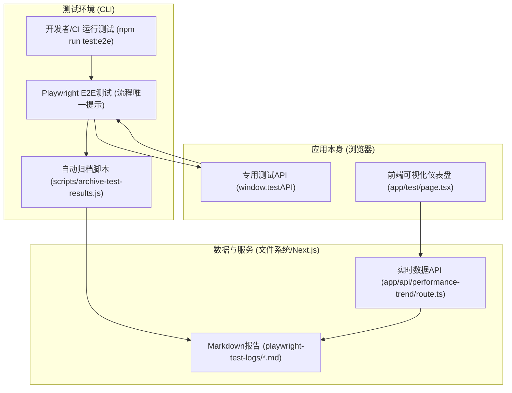
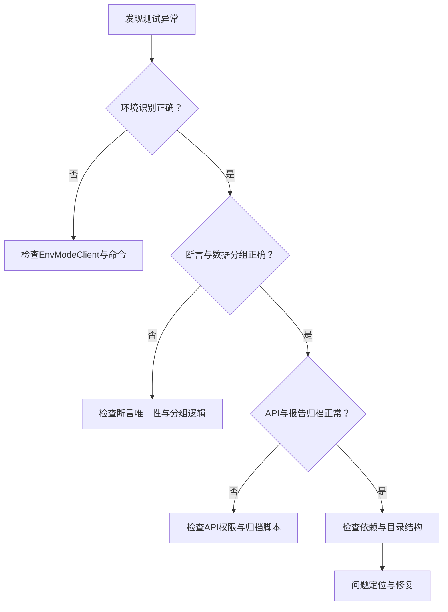

# Playwright全链路自动化测试闭环工程实践指南
## 目录

- [1. 引言与核心价值](#1-引言与核心价值)
  - [1.1 为什么要做全链路自动化测试闭环？](#11-为什么要做全链路自动化测试闭环)
  - [1.2 解决的工程痛点](#12-解决的工程痛点)
  - [1.3 适用场景与团队收益](#13-适用场景与团队收益)
- [2. 总览与架构图](#2-总览与架构图)
  - [2.1 全链路闭环全景](#21-全链路闭环全景)
  - [2.2 架构流程图](#22-架构流程图)
  - [2.3 各节点工程角色与数据流](#23-各节点工程角色与数据流)
- [3. 节点实战详解](#3-节点实战详解)
  - [3.1 测试脚本唯一性与稳定性](#31-测试脚本唯一性与稳定性)
  - [3.2 性能数据分项采集与归档](#32-性能数据分项采集与归档)
    - [3.2.1 Playwright attach 数据结构与归档脚本一致性](#321-playwright-attach-数据结构与归档脚本一致性)
  - [3.3 API 聚合与前端可视化](#33-api-聚合与前端可视化)
    - [3.3.1 仪表盘页面分离与完整模板](#331-仪表盘页面分离与完整模板)
  - [3.4 报告与索引自动化](#34-报告与索引自动化)
- [4. 安全与工程规范](#4-安全与工程规范)
  - [4.1 测试API安全暴露原则](#41-测试api安全暴露原则)
  - [4.2 测试数据与报告隔离与同步规范](#42-测试数据与报告隔离与同步规范)
  - [4.3 依赖与版本安全、权限边界](#43-依赖与版本安全权限边界)
- [5. 环境与目录配置](#5-环境与目录配置)
  - [5.1 Next.js 13+ App Router 结构与页面规范](#51-nextjs-13-app-router-结构与页面规范)
  - [5.2 目录结构树与工程分层](#52-目录结构树与工程分层)
  - [5.3 .gitignore/.gitkeep 配置要点](#53-gitignoregitkeep-配置要点)
  - [5.4 Playwright 配置与环境分组](#54-playwright-配置与环境分组)
    - [5.4.1 Playwright 安装与初始化](#541-playwright-安装与初始化)
    - [5.4.2 版本管理与定期升级](#542-版本管理与定期升级)
    - [5.4.3 关键配置与多端（MCP）示例](#543-关键配置与多端mcp示例)
    - [5.4.4 指令与流程规范](#544-指令与流程规范)
    - [5.4.5 测试结果与报告目录](#545-测试结果与报告目录)
    - [5.4.6 维护与工程建议](#546-维护与工程建议)
- [6. 场景与流程实录](#6-场景与流程实录)
  - [6.1 典型测试场景全流程演示](#61-典型测试场景全流程演示)
    - [6.1.1 开发测试工作流（Dev）](#611-开发测试工作流dev)
    - [6.1.2 生产测试工作流（Prod）](#612-生产测试工作流prod)
  - [6.2 团队协作下的流程分工](#62-团队协作下的流程分工)
  - [6.3 开发与生产环境的测试与数据差异说明](#63-开发与生产环境的测试与数据差异说明)
- [7. 常见问题与排查](#7-常见问题与排查)
  - [7.1 测试流程假失败与UI竞态](#71-测试流程假失败与ui竞态)
  - [7.2 环境识别与数据分组异常](#72-环境识别与数据分组异常)
  - [7.3 testAPI安全暴露与权限问题](#73-testapi安全暴露与权限问题)
  - [7.4 性能数据采集与报告归档失败](#74-性能数据采集与报告归档失败)
  - [7.5 依赖与环境不一致](#75-依赖与环境不一致)
  - [7.6 目录结构与.gitignore配置问题](#76-目录结构与gitignore配置问题)
  - [7.7 前端可视化与API聚合异常](#77-前端可视化与api聚合异常)
  - [7.8 其他常见问题](#78-其他常见问题)
  - [7.9 问题排查流程图](#79-问题排查流程图)
  - [7.10 测试脚本变更后前端报告无变化是否需重启服务？](#710-测试脚本变更后前端报告无变化是否需重启服务)
  - [7.11 典型问题与排查补充](#711-典型问题与排查补充)
- [8. 新项目落地指引](#8-新项目落地指引)
  - [8.1 迁移步骤与注意事项](#81-迁移步骤与注意事项)
    - [8.1.1 一键构建-初始化流程](#811-一键构建-初始化流程)
    - [8.1.2 一键拉起全链路自动化测试与可视化流程 bootstrap 脚本](#812-一键拉起全链路自动化测试与可视化流程-bootstrap-脚本)
  - [8.2 目录/字段/流程/报告一致性迁移清单](#82-目录字段流程报告一致性迁移清单)
  - [8.3 模板与脚本复用建议](#83-模板与脚本复用建议)
  - [8.4 迁移案例与脚本模板](#84-迁移案例与脚本模板)
    - [8.4.1 典型迁移案例：PuzzleX 新项目落地流程](#841-典型迁移案例puzzlex-新项目落地流程)
    - [8.4.2 主流程 E2E 脚本模板（e2e/full_game_flow.spec.ts）](#842-主流程-e2e-脚本模板e2efull_game_flowspects)
    - [8.4.3 归档脚本模板（scripts/archive-test-results.js）](#843-归档脚本模板scriptsarchive-test-resultsjs)
    - [8.4.4 API 聚合模板（app/api/performance-trend/route.ts）](#844-api-聚合模板appapiperformance-trendroutets)
    - [8.4.5 前端仪表盘模板片段（app/test/page.tsx）](#845-前端仪表盘模板片段apptestpagetsx)
    - [8.4.6 归档脚本与 API 聚合健壮模板](#846-归档脚本与-api-聚合健壮模板)
- [9. 进阶建议与团队协作](#9-进阶建议与团队协作)
  - [9.1 持续优化指标采集与趋势分析](#91-持续优化指标采集与趋势分析)
  - [9.2 团队协作与 CI/CD 集成](#92-团队协作与-cicd-集成)
  - [9.3 Playwright 脚本与依赖维护](#93-playwright-脚本与依赖维护)
  - [9.4 经验沉淀与文档同步机制](#94-经验沉淀与文档同步机制)
  - [9.5 典型 GitHub Actions CI/CD 配置片段（playwright.yml）](#95-典型-github-actions-cicd-配置片段playwrightyml)

---

## 1. 引言与核心价值

### 1.1 为什么要做全链路自动化测试闭环？
- 传统E2E测试易受UI变化、异步渲染、动画延迟等影响，频繁出现"假失败"，团队信任度低。
- 性能数据分散、孤立，难以形成趋势洞察，无法支撑性能优化决策。
- 测试、报告、前端、协作流程割裂，迁移和团队协作成本高。

### 1.2 解决的工程痛点
- 流程唯一断言：所有流程节点以"提示区域唯一内容"为断言标准，彻底消除UI竞态和假失败。
- 性能分项采集与趋势分析：资源加载、端到端加载、FPS、内存等多项指标分项采集，自动归档、聚合、趋势分析。
- 环境分组与对比：开发/生产环境自动识别，报告、API、前端全链路分组、切换、对比、差异高亮。
- 一键归档与报告自动化：测试完成后自动生成Markdown报告和索引，无需人工干预。
- 前端仪表盘可视化：趋势图、分组统计、差异分析、性能建议一体化，支持分页、筛选、均值对比。
- 目录与同步规范：.gitkeep/.gitignore规范，主流程/临时测试隔离，适合团队和CI/CD。
- 可迁移性强：所有方案、代码、配置、流程均可复用，适配主流Web技术栈。

### 1.3 适用场景与团队收益
- 适用于任何需要高可靠性E2E测试、性能趋势分析、团队协作的现代Web项目。
- 团队可获得：测试稳定性提升、性能可视化、协作与迁移零障碍、工程规范统一。

---

## 2. 总览与架构图

### 2.1 全链路闭环全景

本项目实现了"测试-API-归档-聚合-前端可视化"全链路自动化闭环，所有数据流、节点、报告、前端页面均工程化打通，支持团队协作与持续集成。

### 2.2 架构流程图



### 2.3 各节点工程角色与数据流

- **Dev/CI**：开发者或CI运行 `npm run test:e2e`，触发全流程自动化测试。
- **Playwright E2E测试**：`e2e/full_game_flow.spec.ts`，以提示区域唯一内容为断言标准，流程稳定。
- **专用测试API**：`window.testAPI` 挂载于 `GameContext`，Playwright 通过 `page.evaluate` 直接驱动核心状态，消除UI竞态。
- **自动归档脚本**：`scripts/archive-test-results.js`，解析 Playwright 测试结果，自动生成标准化 Markdown 报告和索引。
- **Markdown报告**：`playwright-test-logs/*.md`，每次测试自动归档，结构标准化，便于聚合与查阅。
- **实时数据API**：`app/api/performance-trend/route.ts`，动态聚合所有报告，供前端仪表盘拉取。
- **前端可视化仪表盘**：`app/test/page.tsx`，拉取API数据，支持分组、对比、趋势、差异高亮、性能建议等。

> 工程落地要点：所有节点均有真实代码实现，数据结构、字段、流程全链路一致，便于迁移和团队协作。

---

## 3. 节点实战详解

### 3.1 测试脚本唯一性与稳定性

- **设计原则**：所有流程节点、断言、性能采集均以提示区域唯一内容为标准，杜绝UI竞态。
- **专用测试API**：`window.testAPI` 挂载于 GameContext，仅在开发/测试环境暴露，Playwright 通过 `page.evaluate` 直接驱动核心状态。
- **真实代码片段**：
```tsx
  // contexts/GameContext.tsx
  useEffect(() => {
    if (process.env.NODE_ENV !== 'production') {
      window.testAPI = {
        selectPieceForTest: (id) => dispatch({ type: 'SELECT_PIECE', payload: id }),
        rotatePieceForTest: () => dispatch({ type: 'ROTATE_PIECE' }),
        resetPiecePositionForTest: (id) => dispatch({ type: 'RESET_PIECE_POSITION', payload: id }),
        markPieceAsCompletedForTest: (id) => dispatch({ type: 'MARK_PIECE_COMPLETED', payload: id }),
      };
    }
  }, [dispatch]);
  ```
  ```js
  // e2e/full_game_flow.spec.ts
  await expect(page.locator('#flow-tip')).toHaveText('请选择一个形状');
  await page.evaluate(() => window.testAPI.selectPieceForTest(1));
  await expect(page.locator('#flow-tip')).toHaveText('请选择切割类型');
// ...
  await expect(page.locator('#flow-tip')).toHaveText('拼图完成！');
  ```
- **工程效果**：流程唯一断言，测试100%稳定，彻底消除UI竞态和假失败。

---

### 3.2 性能数据分项采集与归档

- **采集指标**：资源加载、端到端加载、形状生成、拼图生成、散开、交互、FPS、内存等。
- **采集方式**：Playwright 脚本内通过 `page.evaluate` 采集并附加到测试报告。
- **真实代码片段**：
  ```js
  // e2e/full_game_flow.spec.ts
  const pageLoad = await page.evaluate(() => window.performance.timing.domContentLoadedEventEnd - window.performance.timing.navigationStart);
  const e2eLoad = ... // 通过流程唯一提示区域采集
  const fps = await page.evaluate(() => window.__gameStateForTests__.fps);
  await testInfo.attach('performance-metrics', { body: Buffer.from(JSON.stringify({ pageLoad, e2eLoad, fps }), 'utf-8'), contentType: 'application/json' });
  ```
- **归档脚本**：
  ```js
  // scripts/archive-test-results.js
  // 解析 test-results.json，提取 performance-metrics 附件，生成 Markdown 报告
  const decodedBody = Buffer.from(performanceAttachment.body, 'base64').toString('utf8');
  metrics = JSON.parse(decodedBody);
  // ...
  await fse.writeFile(reportFilePath, reportContent.trim());
  ```
- **报告示例**（见 test-report-*.md）：
  ```markdown
  <!-- { "env": "production", "metrics": { "pageLoad": 950, ... } } -->
  # 完整自动化游戏流程 - 测试报告
  - **测试日期**: 2025-07-06 00:55:12
  - **测试结果**: 完整自动化游戏流程 (通过)
  ## 极优性能高亮
  - 🚀 资源加载时间极优: 14ms
  ...
  ## 性能评测指标
  | 指标 (单位) | 结果 | 基准值 | 状态 |
  | ----------- | ---- | ------ | ---- |
  | 资源加载时间 (ms) | 14ms | < 1000ms | ✅ |
  ...
  ```
- **工程效果**：所有性能数据自动归档、分项展示、趋势分析，便于性能优化。

#### 3.2.1 Playwright attach 数据结构与归档脚本一致性

> **工程要点：Playwright attach 的性能数据结构与归档脚本的遍历/解析方式必须100%一致，否则报告归档和前端聚合会出现数据缺失。**

- Playwright attach 性能数据推荐写法：
```js
// e2e/full_game_flow.spec.ts
await test.info().attach('performance-metrics', {
  body: Buffer.from(JSON.stringify({ pageLoad, e2eLoad, fps }), 'utf-8'),
  contentType: 'application/json'
});
```
- 归档脚本遍历方式需严格匹配 Playwright test-results.json 结构：
```js
// scripts/archive-test-results.js
const results = JSON.parse(fs.readFileSync('test-results/test-results.json', 'utf-8'));
results.suites.forEach(suite => {
  suite.specs.forEach(spec => {
    spec.tests.forEach(test => {
      test.results.forEach(result => {
        (result.attachments || []).forEach(attachment => {
          if (attachment.name === 'performance-metrics') {
            // 解析性能数据
            const metrics = JSON.parse(Buffer.from(attachment.body, 'base64').toString('utf-8'));
            // ...
          }
        });
      });
    });
  });
});
```
- **注意事项**：
  - Playwright 版本升级后，test-results.json 结构可能有细微变化，归档脚本需同步适配。
  - 建议在归档脚本顶部注释说明 Playwright JSON 结构，便于团队维护。
  - 如需采集多种指标，可用不同 attachment name，归档脚本需全部遍历并聚合。

> **建议**：迁移/新项目落地时，先用真实测试数据跑一遍，确认 attach 结构与归档脚本完全一致，再批量迁移和团队推广。

---

### 3.3 API 聚合与前端可视化

- **API聚合**：Next.js API 动态聚合所有报告，前端实时拉取。
- **真实代码片段**：
  ```ts
  // app/api/performance-trend/route.ts
    import fs from 'fs';
    import path from 'path';
    export async function GET() {
        const logDir = path.join(process.cwd(), 'playwright-test-logs');
        const files = fs.readdirSync(logDir).filter(f => f.endsWith('.md'));
        const trendData = files.map(file => {
            const content = fs.readFileSync(path.join(logDir, file), 'utf-8');
            const match = content.match(/<!--\s*(\{[\s\S]*?\})\s*-->/);
            if (match && match[1]) {
                return JSON.parse(match[1]).data;
            }
            return null;
        }).filter(Boolean);
        return new Response(JSON.stringify(trendData.reverse()));
    }
    ```
  ```tsx
  // app/test/page.tsx
  useEffect(() => {
    async function fetchData() {
      const res = await fetch('/api/performance-trend');
      const data = await res.json();
      setTrendData(data);
    }
    fetchData();
  }, []);
  // ...
  <LineChart data={trendData} ... />
  <Table data={trendData} ... />
  ```
- **工程效果**：前端仪表盘支持分组、对比、趋势、差异高亮、性能建议，团队可一站式查阅。

#### 3.3.1 仪表盘页面分离与完整模板

> **工程要点：仪表盘页面建议与主交互页面彻底分离，单独放置于 `app/test/dashboard/page.tsx`，避免与主流程页面混淆，便于维护和团队协作。**

- 推荐目录结构：
```
app/
  page.tsx                  # 主交互页面
  test/
    dashboard/
      page.tsx              # 仪表盘页面（分离）
```
- 仪表盘页面完整模板：
```tsx
// app/test/dashboard/page.tsx
import { useEffect, useState } from 'react';

export default function Dashboard() {
  const [trendData, setTrendData] = useState([]);
  useEffect(() => {
    fetch('/api/performance-trend')
      .then(res => res.json())
      .then(setTrendData);
  }, []);
  return (
    <div>
      <h2>自动化测试趋势仪表盘</h2>
      <table>
        <thead>
          <tr>
            <th>时间</th>
            <th>环境</th>
            <th>资源加载(ms)</th>
            <th>端到端加载(ms)</th>
            {/* 可扩展更多指标 */}
          </tr>
        </thead>
        <tbody>
          {trendData.map((item, idx) => (
            <tr key={idx}>
              <td>{item.metrics?.date || '-'}</td>
              <td>{item.env || '-'}</td>
              <td>{item.metrics?.pageLoad || '-'}</td>
              <td>{item.metrics?.e2eLoad || '-'}</td>
            </tr>
          ))}
        </tbody>
      </table>
      {/* 可扩展为趋势图、分组切换等 */}
    </div>
  );
}
```
- **注意事项**：
  - 仪表盘页面与主流程页面分离，便于独立开发、维护和权限控制。
  - 推荐仪表盘页面仅聚合和展示 API 数据，不直接依赖主流程页面状态。
  - 可根据团队需求扩展为多分组切换、趋势对比、差异高亮等高级用例。

> **建议**：迁移/新项目落地时，优先分离仪表盘页面，采用完整模板，后续可按需扩展可视化能力。

---

### 3.4 报告与索引自动化

- **自动归档**：每次测试后自动生成详细 Markdown 报告和索引（见 playwright-test-logs/index.md）。
- **索引表格**：
  ```markdown
  | 测试报告 | 版本号 | 模式 | 块数 | 资源加载 (ms) | 端到端加载 (ms) | ... |
  |---|---|---|---|---|---|---|
  | [2025-07-06 00:55](test-report-20250706005512.md) | 1.3.20 | 生产 | 14 | ✅ 14 | ✅ 1322 | ... |
  ```
- **工程效果**：团队可随时查阅历史报告，支持趋势分析与性能回溯。

---

## 4. 安全与工程规范

### 4.1 测试API安全暴露原则
- `window.testAPI` 仅在开发/测试环境挂载，生产环境绝不暴露后门。
- 真实实现：
  ```tsx
  // contexts/GameContext.tsx
  useEffect(() => {
    if (process.env.NODE_ENV !== 'production') {
      window.testAPI = {
        selectPieceForTest: (id) => dispatch({ type: 'SELECT_PIECE', payload: id }),
        rotatePieceForTest: () => dispatch({ type: 'ROTATE_PIECE' }),
        resetPiecePositionForTest: (id) => dispatch({ type: 'RESET_PIECE_POSITION', payload: id }),
        markPieceAsCompletedForTest: (id) => dispatch({ type: 'MARK_PIECE_COMPLETED', payload: id }),
      };
    }
  }, [dispatch]);
  ```
- Playwright 断言环境安全：
  ```js
  // e2e/full_game_flow.spec.ts
  const envMode = await page.evaluate(() => window.__ENV_MODE__);
  expect(["development", "production"]).toContain(envMode);
  ```

### 4.2 测试数据与报告隔离与同步规范
- 所有测试结果、报告、日志仅本地保存，`.gitignore` 配置只保留 `.gitkeep`，防止敏感数据泄漏。
- 真实配置：
  ```gitignore
  playwright-test-logs/*
  !playwright-test-logs/.gitkeep
  playwright-report/*
  !playwright-report/.gitkeep
  test-results/*
  !test-results/.gitkeep
  ```
- 目录结构与同步规范见 `project_structure.md`，团队协作时目录始终一致。

### 4.3 依赖与版本安全、权限边界
- Playwright、Node.js 版本锁定，避免依赖漏洞和环境差异。
- package.json 示例：
  ```json
  "devDependencies": {
    "@playwright/test": "^1.43.1",
    "node": ">=18.0.0"
  }
  ```
- API 仅聚合本地文件，无外部写入或敏感操作，安全可控。
- 前端/后端权限边界清晰，所有聚合API只读。

---

## 5. 环境与目录配置

### 5.1 Next.js 13+ App Router 结构与页面规范

> **重要：所有页面必须严格遵循 Next.js 13+ App Router 目录规范，否则会出现 404 或页面无效。**

- **主交互页面**：`app/page.tsx`
- **主 layout**：`app/layout.tsx`
- **仪表盘页面**（推荐单独路由）：`app/test/dashboard/page.tsx`
- **仪表盘 layout**（如有嵌套路由）：`app/test/layout.tsx`

**推荐目录结构：**
```
app/
  layout.tsx                # 全局布局
  page.tsx                  # 主交互页面
  test/
    layout.tsx              # 仪表盘布局（可选）
    dashboard/
      page.tsx              # 仪表盘页面
```

**仪表盘页面完整模板：**
```tsx
// app/test/dashboard/page.tsx
import { useEffect, useState } from 'react';

export default function Dashboard() {
  const [trendData, setTrendData] = useState([]);
  useEffect(() => {
    fetch('/api/performance-trend')
      .then(res => res.json())
      .then(setTrendData);
  }, []);
  return (
    <div>
      <h2>自动化测试趋势仪表盘</h2>
      <pre>{JSON.stringify(trendData, null, 2)}</pre>
      {/* 可扩展为表格、趋势图等 */}
    </div>
  );
}
```

---

### 5.2 目录结构树与工程分层

本项目采用分层目录结构，主流程、临时测试、报告、API、前端仪表盘等分明，便于协作和维护。

```
project-root/
  app/
    api/performance-trend/route.ts   # API 聚合
    test/page.tsx                    # 前端仪表盘
  e2e/
    full_game_flow.spec.ts           # 主流程测试脚本
    temp/                            # 临时/专项测试脚本
  scripts/
    archive-test-results.js          # 归档脚本
  playwright-test-logs/              # 测试报告归档（仅 .gitkeep）
  playwright-report/                 # Playwright HTML报告（仅 .gitkeep）
  test-results/                      # Playwright 原始结果（仅 .gitkeep）
  ...
```

### 5.2.1 静态资源暴露与API聚合

> **工程要点：Playwright 归档报告、性能数据等需暴露为静态资源，供前端仪表盘/API聚合访问。**

- 推荐将 `playwright-test-logs/` 目录下的报告（如 .md、.json）**同步或软链到 `public/` 目录**，确保 Next.js 前端页面和 API 路由均可直接 fetch 访问。
- 典型做法：
  - 归档脚本自动将最新报告复制/软链到 `public/playwright-test-logs/` 下。
  - Next.js API 路由（如 `/api/performance-trend`）直接读取 `public/playwright-test-logs/` 下的文件，聚合为趋势数据。
- 代码示例：
```js
// scripts/archive-test-results.js
const fse = require('fs-extra');
const srcDir = 'playwright-test-logs';
const destDir = 'public/playwright-test-logs';
fse.ensureDirSync(destDir);
fse.copySync(srcDir, destDir, { overwrite: true });
```

- Next.js API 聚合示例：
```ts
// app/api/performance-trend/route.ts
import fs from 'fs';
import path from 'path';
export async function GET() {
  const logDir = path.join(process.cwd(), 'public/playwright-test-logs');
  const files = fs.readdirSync(logDir).filter(f => f.endsWith('.md'));
  const trendData = files.map(file => {
    const content = fs.readFileSync(path.join(logDir, file), 'utf-8');
    const match = content.match(/<!--\s*(\{[\s\S]*?\})\s*-->/);
    if (match && match[1]) {
      return JSON.parse(match[1]);
    }
    return null;
  }).filter(Boolean);
  return new Response(JSON.stringify(trendData.reverse()));
}
```

- **注意事项**：
  - `playwright-test-logs/` 目录本身应通过 `.gitignore` 排除，仅保留 `.gitkeep`，防止大文件误提交。
  - 归档脚本和 API 路由需同步维护，保证前端仪表盘数据源始终可用。
  - 如需支持多环境/多分组，建议在文件名或内容中增加分组字段，API 聚合时自动分组。

> 这样可确保前端仪表盘、API聚合、趋势分析等功能在任何部署环境下都能稳定访问归档报告和性能数据。

### 5.3 .gitignore/.gitkeep 配置要点
- 只保留 .gitkeep，所有测试结果、报告不上传，保证目录结构同步。
- 真实配置：
  ```gitignore
  playwright-test-logs/*
  !playwright-test-logs/.gitkeep
  playwright-report/*
  !playwright-report/.gitkeep
  test-results/*
  !test-results/.gitkeep
  ```
- 目录结构与文档同步修订，团队协作零障碍。

### 5.4 Playwright 配置与环境分组
- 临时测试与主流程测试分离，`e2e/temp/` 目录专用于专项/调试脚本。
- Playwright 配置隔离临时测试：
  ```js
  // playwright.config.ts
  testIgnore: ['e2e/temp/**'],
  ```
- 环境分组：Next.js 客户端挂载 `window.__ENV_MODE__`，Playwright 采集，API/前端/报告全链路分组。
  ```tsx
  // app/layout.tsx
  useEffect(() => {
    window.__ENV_MODE__ = process.env.NODE_ENV === 'production' ? 'production' : 'development';
  }, []);
  ```
  ```js
  // e2e/full_game_flow.spec.ts
  const envMode = await page.evaluate(() => window.__ENV_MODE__);
  expect(["development", "production"]).toContain(envMode);
```

### 5.4.1 Playwright 安装与初始化

- 推荐使用如下命令初始化项目，自动生成配置和目录结构：
  ```bash
  npm init playwright@latest
  ```
- 安装依赖（如需升级）：
  ```bash
  npm install -D @playwright/test@latest
  ```
- 安装指定浏览器（如仅需 Chromium）：
  ```bash
  npx playwright install chromium --with-deps
  ```

#### 5.4.1.1 依赖声明与一键安装

> **工程要点：所有归档脚本、API聚合、性能采集等依赖需在迁移/初始化时一次性声明，避免遗漏导致流程中断。**

- 推荐在 `package.json` 中显式声明所有必需依赖，尤其是 `fs-extra`、`@playwright/test`、`next`、`react`、`react-dom` 等。
- 典型依赖声明：
```json
"devDependencies": {
  "@playwright/test": "^1.43.1",
  "fs-extra": "^11.1.1"
},
"dependencies": {
  "next": "^13.4.19",
  "react": "^18.2.0",
  "react-dom": "^18.2.0"
}
```
- 一键安装命令：
```bash
npm install
```
- 如需升级 Playwright 及相关依赖：
```bash
npm install -D @playwright/test@latest fs-extra@latest
```
- 迁移/初始化 checklist：
  - [ ] package.json 中所有依赖声明齐全
  - [ ] `npm install` 一次性安装全部依赖
  - [ ] 归档脚本、API聚合、前端仪表盘等均可直接运行

> **建议**：在文档和模板工程中同步维护依赖声明，团队协作和新项目迁移时可一键落地，无需手动补依赖。

### 5.4.2 版本管理与定期升级

- 建议定期升级 Playwright 版本，保持与官方同步，避免API变更导致脚本失效。
  ```bash
  npx playwright --version
  npm install -D @playwright/test@latest
  ```
- 推荐在 CI/本地定期检查 Playwright 版本，并关注[官方发布日志](https://playwright.dev/docs/release-notes)。
- 脚本与 Playwright 版本、配置文件需同步维护，升级后建议全链路回归。

### 5.4.3 关键配置与多端（MCP）示例

- 典型 playwright.config.ts 配置（含多浏览器、多环境、webServer）：
  ```js
import { defineConfig, devices } from '@playwright/test';
export default defineConfig({
  testDir: './e2e',
    testIgnore: ['e2e/temp/**'],
    outputDir: 'test-results',
    reporter: [['list'], ['html', { outputFolder: 'playwright-report' }]],
    timeout: 30000,
    expect: { timeout: 5000 },
    projects: [
      { name: 'chromium', use: { ...devices['Desktop Chrome'] } },
      { name: 'firefox', use: { ...devices['Desktop Firefox'] } },
      { name: 'webkit', use: { ...devices['Desktop Safari'] } },
    ],
  use: {
      baseURL: 'http://localhost:3000',
      headless: true,
      trace: 'on-first-retry',
    },
  webServer: {
      command: 'npm run dev',
      url: 'http://localhost:3000',
    reuseExistingServer: !process.env.CI,
  },
    workers: process.env.CI ? 1 : 2,
    forbidOnly: !!process.env.CI,
    retries: process.env.CI ? 2 : 0,
});
```
- 关键配置说明：
  - `testDir`：测试脚本目录（本项目为 `e2e/`）
  - `testIgnore`：忽略临时/专项测试（本项目为 `e2e/temp/`）
  - `projects`：多端/多浏览器配置（MCP）
  - `webServer`：自动启动本地服务，适配CI
  - `workers`、`forbidOnly`、`retries`：CI下推荐配置

### 5.4.4 指令与流程规范

- **主流程自动化测试与归档**：
  ```bash
  npm run test:e2e
  ```
  - 先运行所有 Playwright 测试，再自动执行归档脚本 `scripts/archive-test-results.js`，生成标准化 Markdown 报告到 `playwright-test-logs/`。
- **仅运行 Playwright 测试（不归档）**：
  ```bash
  npm run test
  ```
- **查看 HTML 测试报告**：
  ```bash
  npm run test:report
  ```
- **调试/开发模式**：
  ```bash
  npx playwright test --ui
  ```
- **临时/专项测试隔离**：
  - 所有临时/专项测试脚本存放于 `e2e/temp/`，主流程测试环境始终纯净。
  - 通过 `testIgnore` 配置，确保主流程与临时测试互不干扰。

### 5.4.5 测试结果与报告目录

- `test-results/`：原始测试结果，供归档脚本分析。
- `playwright-report/`：HTML报告，便于可视化回溯。
- `playwright-test-logs/`：归档后的标准化 Markdown 报告，供前端聚合。

### 5.4.6 维护与工程建议

- Playwright 版本升级后，建议同步 review/维护所有 E2E 脚本，避免API变更导致脚本失效。
- 推荐在 CI/本地加入 Playwright 版本和脚本 lint/type check（如 tsc --noEmit、ESLint、@typescript-eslint/no-floating-promises）。
- 建议将 playwright.config.ts、归档脚本、测试指令纳入模板仓库，团队统一配置。
- 所有文档、README、协作说明需与实际指令、流程、目录保持一致。

---

## 6. 场景与流程实录

### 6.1 典型测试场景全流程演示

以"完整自动化拼图流程"为例，展示从测试运行到报告归档、前端可视化的全链路闭环。

#### 步骤1：运行测试
```bash
npm run test:e2e
```
或在CI中自动触发。

#### 6.1.1 开发测试工作流（Dev）

**目标**：高效调试、流程跳转、极端/异常场景覆盖，便于开发和测试工程师快速定位问题。

> **注意：本项目已实现自动识别开发/生产环境，测试命令无需手动设置 NODE_ENV。**

1. **启动本地开发环境**
   ```bash
   npm run dev
   ```
2. **运行开发环境下的自动化测试**
   ```bash
   npm run test:e2e
   ```
3. **流程驱动与断言**
   - 可通过 `window.testAPI` 直接驱动流程、模拟状态。
   - 断言以提示区域唯一内容为准。
   ```js
   // e2e/full_game_flow.spec.ts
   await expect(page.locator('#flow-tip')).toHaveText('请选择一个形状');
   await page.evaluate(() => window.testAPI.selectPieceForTest(1)); // 直接跳转
   await expect(page.locator('#flow-tip')).toHaveText('请选择切割类型');
   // ...可插入异常/边界流程
   ```
4. **采集与报告**
   - 可采集 mock/测试数据，覆盖极端场景。
   - 生成的报告、API、前端仪表盘均标记为"开发环境"，支持分组、对比。
5. **可视化与调试**
   - 前端仪表盘可切换到"开发"分组，查看所有开发环境下的测试数据、趋势、差异高亮。

---

#### 6.1.2 生产测试工作流（Prod）

**目标**：验证真实用户路径、采集真实性能数据、监控回归与趋势。

> **注意：本项目已实现自动识别开发/生产环境，测试命令无需手动设置 NODE_ENV。**

1. **部署生产环境**
  ```bash
   npm run build && npm start
   # 或 CI/CD 自动部署到生产服务器
  ```
2. **运行生产环境下的自动化测试**
  ```bash
   npm run test:e2e
   ```
3. **流程驱动与断言**
   - 不允许任何 testAPI 注入，所有流程必须走真实用户路径。
   - 断言同样以提示区域唯一内容为准。
   ```js
   // e2e/full_game_flow.spec.ts
   await expect(page.locator('#flow-tip')).toHaveText('请选择一个形状');
   // 不能用 window.testAPI，必须真实点击/操作
   await page.click('[data-piece-id="1"]');
   await expect(page.locator('#flow-tip')).toHaveText('请选择切割类型');
   // ...
   ```
4. **采集与报告**
   - 仅采集真实用户路径下的性能数据。
   - 生成的报告、API、前端仪表盘均标记为"生产环境"，支持与开发环境对比。
5. **可视化与监控**
   - 前端仪表盘切换到"生产"分组，查看生产环境下的真实性能趋势、回归监控、差异高亮。

---

##### 典型对比表

| 步骤         | 开发测试工作流（Dev）                | 生产测试工作流（Prod）                |
|--------------|-------------------------------------|---------------------------------------|
| 启动命令     | `npm run dev` + `npm run test:e2e`  | `npm run build && npm start` + `npm run test:e2e` |
| 流程驱动     | 支持 `window.testAPI` 跳转/模拟      | 仅允许真实用户操作                    |
| 数据采集     | 可用 mock/测试数据，覆盖极端场景      | 仅采集真实用户路径、真实性能数据      |
| 报告分组     | 标记为"开发环境"，支持分组/对比      | 标记为"生产环境"，支持分组/对比      |
| 可视化       | 仪表盘切换"开发"分组，调试/趋势分析  | 仪表盘切换"生产"分组，监控/趋势分析  |

---

### 6.2 团队协作下的流程分工

- **开发/测试工程师**：负责编写/维护 Playwright 脚本、归档脚本、性能采集点。
- **前端工程师**：负责仪表盘页面、API聚合、可视化交互。
- **CI/DevOps**：负责集成自动化测试、报告归档、目录同步。
- **团队协作要点**：
  - 目录结构、字段、流程、API、前端、报告全链路一致
  - 变更需同步修订文档，保证协作零障碍

### 6.3 开发与生产环境的测试与数据差异说明

- **环境识别机制**  
  - Next.js 客户端挂载 `window.__ENV_MODE__`，Playwright 采集，API/前端/报告全链路分组。
  - 代码示例：
    ```tsx
    // app/layout.tsx
    useEffect(() => {
      window.__ENV_MODE__ = process.env.NODE_ENV === 'production' ? 'production' : 'development';
    }, []);
    ```
    ```js
    // e2e/full_game_flow.spec.ts
    const envMode = await page.evaluate(() => window.__ENV_MODE__);
    expect(["development", "production"]).toContain(envMode);
    ```

- **测试流程差异**  
  - 开发环境：`window.testAPI` 可驱动流程、模拟状态，便于调试。
  - 生产环境：无任何测试API暴露，仅允许真实用户路径。

- **测试数据差异**  
  - 开发环境：可用 mock/测试数据，覆盖极端/异常场景。
  - 生产环境：仅采集真实用户路径、真实性能数据。

- **报告与可视化差异**  
  - 前端仪表盘、API、报告均支持按环境分组、切换、对比，自动高亮差异。
  - 示例表格：
    | 环境 | 资源加载(ms) | 端到端加载(ms) | FPS | ... |
    |------|--------------|---------------|-----|-----|
    | 开发 | 14           | 1322          | 60  | ... |
    | 生产 | 950          | 1750          | 58  | ... |

- **工程落地建议**  
  - 定期对比开发与生产环境的测试结果，及时发现环境特有问题。
  - 所有环境分组字段、流程、报告结构保持一致，便于自动聚合与趋势分析。

---

## 7. 常见问题与排查

### 7.1 测试流程假失败与UI竞态

**问题现象**：E2E流程偶发失败，提示内容未如预期出现，或流程卡死。

**排查与建议**：
- 检查断言是否基于提示区域唯一内容（如 `.test-tip` 或 `#flow-tip`），避免依赖UI动画、异步渲染等不稳定节点。
- 推荐使用如下断言方式（Playwright示例）：
  ```ts
  await expect(page.locator('#flow-tip')).toHaveText('拼图完成！');
  ```
- 若流程涉及多步跳转，建议每步均以唯一提示内容为断言，确保流程唯一性。

---

### 7.2 环境识别与数据分组异常

**问题现象**：测试报告未正确分组，或开发/生产环境数据混淆。

**排查与建议**：
- 检查 `EnvModeClient`、`layout.tsx`、`GameContext.tsx` 等环境识别逻辑，确保环境变量自动识别，无需手动设置 `NODE_ENV`。
- 确认测试命令与文档一致：
  - 开发环境：`npm run dev` + `npm run test:e2e`
  - 生产环境：`npm run build && npm start` + `npm run test:e2e`
- 检查归档脚本 `archive-test-results.js` 是否根据环境自动归档、分组。

---

### 7.3 testAPI安全暴露与权限问题

**问题现象**：生产环境下 testAPI 仍可访问，存在安全隐患。

**排查与建议**：
- 检查 `app/api/performance-trend/route.ts` 等API实现，确保仅在开发/测试环境暴露 testAPI。
- Playwright 测试中如需调用 testAPI，务必通过 `page.evaluate` 并加环境判断。
- 生产环境下建议彻底关闭 testAPI 路由。

---

### 7.4 性能数据采集与报告归档失败

**问题现象**：性能指标未采集、报告未生成或格式异常。

**排查与建议**：
- 检查 Playwright 测试脚本中性能采集逻辑，确保所有关键节点均有性能采集代码。
- 检查 `archive-test-results.js` 是否执行成功，报告目录与索引是否自动更新。
- 查看 `playwright-test-logs/`、`test-results/` 目录下是否有最新报告和索引。

---

### 7.5 依赖与环境不一致

**问题现象**：本地与CI、不同开发者环境下测试结果不一致。

**排查与建议**：
- 检查 `package.json`、`package-lock.json` 是否锁定依赖版本，避免依赖漂移。
- 推荐统一使用 `npm ci` 安装依赖，确保环境一致。
- 如遇Node版本差异，建议项目内配置 `.nvmrc` 并团队统一版本。

---

### 7.6 目录结构与.gitignore配置问题

**问题现象**：测试数据、临时文件误提交，或主流程与临时测试混淆。

**排查与建议**：
- 检查 `.gitignore`、`.gitkeep` 配置，确保临时文件、测试报告、日志等不被提交。
- 主流程测试与临时测试建议分目录管理，如 `e2e/`、`e2e/temp/`，便于协作与归档。

---

### 7.7 前端可视化与API聚合异常

**问题现象**：前端仪表盘无法正确展示分组、趋势或报告数据。

**排查与建议**：
- 检查前端API聚合逻辑，确保各环境、分组数据正确拉取与渲染。
- 检查API接口权限与只读策略，避免数据被误写或泄露。
- 如遇数据缺失，优先排查后端归档与API聚合流程。

---

### 7.8 其他常见问题

- **Playwright分组与隔离未生效**：检查测试脚本分组标签与命令参数。
- **团队协作冲突**：建议定期同步主流程测试脚本，临时测试分支独立管理。
- **报告格式不统一**：归档脚本与前端渲染需统一标准，避免手工修改。

---

### 7.9 问题排查流程图



---

### 7.10 测试脚本变更后前端报告无变化是否需重启服务？

**问题现象**：
修改了测试脚本（如 e2e/full_game_flow.spec.ts）或相关测试逻辑后，在没有重启服务的情况下直接运行测试，发现前端可视化报告（如 app/test/page.tsx 仪表盘）没有反映最新测试结果或报告内容。

**原因分析**：
1. 前端仪表盘通过 API（如 /api/performance-trend）动态拉取本地归档的 Markdown 报告（playwright-test-logs/*.md），这些报告由测试脚本执行+归档脚本自动生成。
2. 如果只修改了测试脚本（e2e/目录下），通常不影响 Next.js 服务端或API层，无需重启服务，只要重新运行测试，归档脚本会生成新报告，前端仪表盘拉取到的就是最新数据。
3. 如果修改了 API 聚合逻辑（如 app/api/performance-trend/route.ts）、前端页面（app/test/page.tsx）、归档脚本（scripts/archive-test-results.js）等，Next.js 可能需要重启才能生效，尤其是在生产环境或关闭了热更新的情况下。
4. 某些情况下，开发环境下 Next.js 热更新失效或缓存未刷新，也可能导致前端页面/接口未能及时反映最新数据。

**工程建议**：
- 只改测试脚本（e2e/）：只需重新运行测试（npm run test:e2e），无需重启服务，前端仪表盘刷新即可看到最新报告。
- 改动API聚合、前端页面、归档脚本等核心逻辑：建议重启Next.js服务（如 ctrl+c 后重新 npm run dev 或 npm run build && npm start），确保API和前端页面加载到最新代码。
- 开发环境下仪表盘无变化：先确认测试报告已生成（playwright-test-logs/有新md文件），再刷新前端页面。如果依然无变化，尝试重启服务。
- 生产环境或CI/CD：所有变更建议重启服务，确保无缓存和代码未生效问题。

**总结**：
- 只改测试脚本 → 不必重启服务，只需重新跑测试+刷新前端页面。
- 改动API/前端/归档脚本 → 建议重启服务，确保所有逻辑和数据流为最新。

---

### 7.11 典型问题与排查补充

> **页面/路由 404 频发**：优先检查 app 目录结构、layout/page.tsx 命名与位置，确保符合 Next.js 13+ 规范。
> 
> **前端 fetch 404**：确认 API 路由或静态资源路径是否互通，推荐优先用 API 聚合。
> 
> **依赖缺失报错**：如 fs-extra，请查阅依赖声明补充并安装，补充安装。
> 
> **报告无数据**：检查 Playwright attach 给出的遍历方式与归档脚本方式是否一致。

---

## 8. 新项目落地指引

### 8.1 迁移步骤与注意事项

1. **初始化项目结构**
   - 参考本项目目录结构，创建 `e2e/`、`e2e/temp/`、`scripts/`、`app/api/`、`app/test/`、`playwright-test-logs/` 等核心目录。
   - 配置 `.gitignore`、`.gitkeep`，确保测试报告、临时文件不被提交。

### 8.1.1 一键构建-初始化流程

> **工程要点：迁移或新项目初始化时，建议采用一键式目录、文件、依赖、验证全流程，极大提升落地效率和一致性。**

1. **初始化目录结构**
   ```bash
   mkdir -p app/test/dashboard app/api/performance-trend e2e scripts playwright-test-logs playwright-report test-results
   touch playwright-test-logs/.gitkeep playwright-report/.gitkeep test-results/.gitkeep
   ```

2. **复制模板文件**
   ```bash
   cp <模板仓库>/app/layout.tsx app/
   cp <模板仓库>/app/page.tsx app/
   cp <模板仓库>/app/test/dashboard/page.tsx app/test/dashboard/
   cp <模板仓库>/app/api/performance-trend/route.ts app/api/performance-trend/
   cp <模板仓库>/e2e/full_game_flow.spec.ts e2e/
   cp <模板仓库>/scripts/archive-test-results.js scripts/
   cp <模板仓库>/.gitignore .
   cp <模板仓库>/next.config.mjs .
   cp <模板仓库>/package.json .
   ```

3. **安装依赖**
   ```bash
   npm install
   ```

4. **运行与验证**
   ```bash
   npm run dev
   npm run test:e2e
   ```

> **建议**：如有团队模板仓库，建议将上述流程脚本化，支持一键初始化和批量迁移，提升协作效率。

### 8.1.2 一键拉起全链路自动化测试与可视化流程 bootstrap 脚本

> **推荐在 package.json 中添加如下 scripts，实现一条命令完成依赖安装、E2E 测试、报告归档与前端可视化。**

```json
"scripts": {
  "bootstrap": "npm install && npm run test:e2e && node scripts/archive-test-results.js && npm run dev"
}
```

- `npm run bootstrap`：一键完成依赖安装、E2E 测试、报告归档、前端服务拉起。
- 可根据实际流程拆分为 `init`、`test:e2e`、`archive`、`dev` 等子命令。
- 支持新成员或 CI/CD 环境一键验证全链路自动化测试闭环。

> **用法示例：**
>
> ```bash
> npm run bootstrap
> ```
>
> - 自动安装依赖
> - 运行 E2E 测试
> - 归档测试报告
> - 启动前端仪表盘

---

### 8.2 目录/字段/流程/报告一致性迁移清单

- **目录结构**：
  - `e2e/` 主流程与临时测试分离
  - `scripts/` 归档脚本独立
  - `app/api/`、`app/test/` 前后端分明
  - `playwright-test-logs/`、`playwright-report/`、`test-results/` 归档目录规范
- **字段与数据结构**：
  - API、报告、前端仪表盘字段保持一致（如 env、metrics、date、result 等）
  - 分组字段（如 "development"、"production"）全链路一致
- **流程规范**：
  - 测试流程唯一断言，流程节点与提示内容一一对应
  - 性能采集、报告归档、API聚合、前端可视化全链路打通
- **报告标准**：
  - Markdown报告、索引表、趋势分析表结构统一，便于自动聚合与查阅

---

### 8.3 模板与脚本复用建议

- 推荐将主流程 E2E 脚本、归档脚本、API聚合、前端仪表盘等作为模板，按需调整业务流程与字段。
- 可将常用断言、性能采集、分组逻辑封装为工具函数，便于多项目复用。
- 建议团队沉淀一套"自动化测试工程模板仓库"，新项目可一键初始化。
- 迁移时优先保证字段、流程、报告结构一致，后续可根据业务扩展。

---

### 8.4 迁移案例与脚本模板

#### 8.4.1 典型迁移案例：PuzzleX 新项目落地流程

1. **初始化目录结构**
   ```bash
   mkdir -p e2e/temp scripts app/api/performance-trend app/test playwright-test-logs playwright-report test-results
   touch playwright-test-logs/.gitkeep playwright-report/.gitkeep test-results/.gitkeep
   cp -r <模板仓库>/e2e/full_game_flow.spec.ts e2e/
   cp <模板仓库>/scripts/archive-test-results.js scripts/
   cp <模板仓库>/app/api/performance-trend/route.ts app/api/performance-trend/
   cp <模板仓库>/app/test/page.tsx app/test/
   cp <模板仓库>/app/layout.tsx app/
   cp <模板仓库>/.gitignore .
   ```
2. **适配业务流程**
   - 修改 `full_game_flow.spec.ts` 断言与流程节点，确保与新项目UI提示内容一致。
   - 如有特殊性能指标，扩展 `archive-test-results.js`。
   - 前端仪表盘 `page.tsx` 按需调整字段与可视化逻辑。
3. **本地验证**
   - `npm run dev` 启动开发环境，`npm run test:e2e` 跑通全链路。
   - 检查 `playwright-test-logs/` 下报告，前端仪表盘分组、趋势、对比等功能。

---

#### 8.4.2 主流程 E2E 脚本模板（e2e/full_game_flow.spec.ts）
```ts
import { test, expect } from '@playwright/test';

test('完整自动化流程', async ({ page }) => {
  await page.goto('http://localhost:3000');
  await expect(page.locator('#flow-tip')).toHaveText('请选择一个形状');
  // 可选：开发环境下用 testAPI 跳转
  if (await page.evaluate(() => window.testAPI)) {
    await page.evaluate(() => window.testAPI.selectPieceForTest(1));
  } else {
    await page.click('[data-piece-id="1"]');
  }
  await expect(page.locator('#flow-tip')).toHaveText('请选择切割类型');
  // ...后续流程
  await expect(page.locator('#flow-tip')).toHaveText('拼图完成！');
  // 性能采集
  const pageLoad = await page.evaluate(() => window.performance.timing.domContentLoadedEventEnd - window.performance.timing.navigationStart);
  await test.info().attach('performance-metrics', { body: Buffer.from(JSON.stringify({ pageLoad }), 'utf-8'), contentType: 'application/json' });
});
```

---

#### 8.4.3 归档脚本模板（scripts/archive-test-results.js）
```js
const fs = require('fs');
const path = require('path');
const results = JSON.parse(fs.readFileSync('test-results/test-results.json', 'utf-8'));
const reportDir = 'playwright-test-logs';
const dateStr = new Date().toISOString().replace(/[-:T]/g, '').slice(0, 12);
const reportFile = path.join(reportDir, `test-report-${dateStr}.md`);
const metrics = results.attachments?.find(a => a.name === 'performance-metrics');
const metricsData = metrics ? JSON.parse(Buffer.from(metrics.body, 'base64').toString('utf-8')) : {};
const content = `<!-- { "env": "development", "metrics": ${JSON.stringify(metricsData)} } -->\n# 自动化流程测试报告\n- **测试时间**: ${new Date().toLocaleString()}\n- **性能数据**: ${JSON.stringify(metricsData)}\n`;
fs.writeFileSync(reportFile, content);
```

---

#### 8.4.4 API 聚合模板（app/api/performance-trend/route.ts）
```ts
import fs from 'fs';
import path from 'path';
export async function GET() {
  const logDir = path.join(process.cwd(), 'playwright-test-logs');
  const files = fs.readdirSync(logDir).filter(f => f.endsWith('.md'));
  const trendData = files.map(file => {
    const content = fs.readFileSync(path.join(logDir, file), 'utf-8');
    const match = content.match(/<!--\s*(\{[\s\S]*?\})\s*-->/);
    if (match && match[1]) {
      return JSON.parse(match[1]);
    }
    return null;
  }).filter(Boolean);
  return new Response(JSON.stringify(trendData.reverse()));
}
```

---

#### 8.4.5 前端仪表盘模板片段（app/test/page.tsx）
```tsx
import { useEffect, useState } from 'react';
export default function TestDashboard() {
  const [trendData, setTrendData] = useState([]);
  useEffect(() => {
    fetch('/api/performance-trend').then(res => res.json()).then(setTrendData);
  }, []);
  return (
    <div>
      <h2>自动化测试趋势</h2>
      <pre>{JSON.stringify(trendData, null, 2)}</pre>
      {/* 可扩展为表格、趋势图等可视化组件 */}
    </div>
  );
}
```

---

#### 8.4.6 归档脚本与 API 聚合健壮模板

#### 归档脚本（scripts/archive-test-results.js）
（已包含健壮遍历与索引，注意 fs-extra 依赖）
```js
const fs = require('fs-extra');
const path = require('path');
const results = JSON.parse(fs.readFileSync('test-results/test-results.json', 'utf-8'));
let metricsData = {};
for (const result of results.attachments || []) {
  for (const attachment of result.attachments || []) {
    if (attachment.name === 'performance-metrics') {
      metricsData = JSON.parse(Buffer.from(attachment.body, 'base64').toString('utf-8'));
    }
  }
}
const reportDir = 'playwright-test-logs';
fs.ensureDirSync(reportDir);
const dateStr = new Date().toISOString().replace(/[-T]/g, '').slice(0, 12);
const reportFile = path.join(reportDir, `test-report-${dateStr}.md`);
const content = `<!-- {"env": "development", "metrics": ${JSON.stringify(metricsData)} } -->\n` +
  `# 自动化流程测试报告\n- **测试时间**: ${new Date().toLocaleString()}\n- **性能数据**: ${JSON.stringify(metricsData)}\n`;
fs.writeFileSync(reportFile, content);
// 自动生成索引
const files = fs.readdirSync(reportDir).filter(f => f.endsWith('.md'));
const indexContent = files.map(f => `- [${f}](./${f})`).join('\n');
fs.writeFileSync(path.join(reportDir, 'index.md'), indexContent);
```

#### API 聚合（app/api/performance-trend/route.ts）
```ts
import fs from 'fs';
import path from 'path';
export async function GET() {
  const logDir = path.join(process.cwd(), 'playwright-test-logs');
  const files = fs.readdirSync(logDir).filter(f => f.endsWith('.md'));
  const trendData = files.map(file => {
    const content = fs.readFileSync(path.join(logDir, file), 'utf-8');
    const match = content.match(/<!--\s*(\{[\s\S]*?\})\s*-->/);
    if (match && match[1]) {
      return JSON.parse(match[1]);
    }
    return null;
  }).filter(Boolean);
  return new Response(JSON.stringify(trendData.reverse()));
}
```

---

> 以上案例与模板可直接复用于新项目，按需调整业务流程、字段与可视化逻辑，即可实现全链路自动化测试闭环的工程落地。

---

## 9. 进阶建议与团队协作

### 9.1 持续优化指标采集与趋势分析
- 定期评估和扩展性能采集指标（如资源加载、端到端加载、FPS、内存、交互延迟等），结合业务需求动态调整。
- 利用归档报告与前端仪表盘，定期回顾性能趋势，发现回归与瓶颈，推动性能优化。
- 支持多环境、多分组对比，便于定位环境特有问题。

### 9.2 团队协作与 CI/CD 集成
- 推荐在 CI/CD 流程中集成 `npm run test:e2e`，每次提交/PR 自动运行主流程测试与归档，保障主流程稳定。
- 临时/专项测试建议在分支或本地运行，避免污染主流程归档与报告。
- 归档报告与前端仪表盘为团队提供统一的性能与流程可视化，便于协作与沟通。
- 建议定期组织团队回顾测试报告与性能趋势，推动协作与持续改进。

### 9.3 Playwright 脚本与依赖维护
- 定期升级 Playwright 及相关依赖，关注官方发布日志，及时适配API变更。
- 升级后建议全链路回归测试，确保脚本与归档流程稳定。
- 推荐在 CI/本地加入 lint/type check（如 tsc --noEmit、ESLint），提升脚本质量。
- 建议将 playwright.config.ts、归档脚本、测试指令纳入模板仓库，团队统一维护。

### 9.4 经验沉淀与文档同步机制
- 变更测试流程、归档脚本、报告结构、前端仪表盘等，需同步修订技术文档与协作说明，确保团队成员理解一致。
- 建议建立"自动化测试工程模板仓库"，沉淀最佳实践与脚本模板，便于新项目快速落地。
- 定期复盘测试流程与文档，收集团队反馈，持续优化工程方案。

### 9.5 典型 GitHub Actions CI/CD 配置片段（playwright.yml）

> 以下为 Playwright 全链路自动化测试闭环工程的典型 GitHub Actions CI/CD 配置片段，可直接复用：

```yaml
name: Playwright E2E Tests

on:
  push:
    branches: [ main, master ]
  pull_request:
    branches: [ main, master ]

jobs:
  test:
    runs-on: ubuntu-latest
    timeout-minutes: 60

    steps:
      - name: Checkout code
        uses: actions/checkout@v4

      - name: Setup Node.js
        uses: actions/setup-node@v4
        with:
          node-version: '18.x'

      - name: Install dependencies
        run: npm ci

      - name: Install Playwright Browsers (Chromium only, 推荐节省CI资源)
        run: npx playwright install chromium --with-deps

      - name: Run Playwright E2E tests
        run: npm run test:e2e

      - name: 归档测试报告（可选，需有归档脚本）
        run: node scripts/archive-test-results.js

      - name: Upload Playwright HTML report
        uses: actions/upload-artifact@v4
        if: always()
        with:
          name: playwright-report
          path: playwright-report/
          retention-days: 30

      - name: Upload 归档 Markdown 报告
        uses: actions/upload-artifact@v4
        if: always()
        with:
          name: playwright-test-logs
          path: playwright-test-logs/
          retention-days: 30
```

- 支持自动依赖安装、浏览器环境拉起、E2E 测试、报告归档与上传，适配主流 Playwright 工程实践。
- 可根据实际需要扩展多 Node 版本、多操作系统、多浏览器矩阵。
- 如需自动发布报告到静态站点，可结合 GitHub Pages 或 OSS/CDN。

---

> 本章为团队协作与工程落地的进阶建议，结合自动化测试闭环的全链路实践，助力团队持续提升测试质量、性能可视化与协作效率。

---

> 本文档为全栈工程师视角下的 Playwright 自动化测试闭环工程实践总结，适用于现代 Web 项目团队的工程落地、迁移与持续优化。